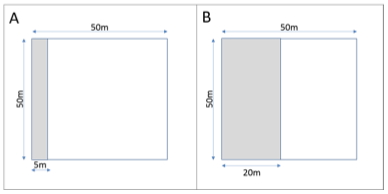

<style>
body {
text-align: justify}
</style>

<br>

# Background

In order to calculate Above-ground biomass (AGB) from field inventories, allometric ecuations are used. In this case, we applied Chave et al. (2014) Eq. 4:

$$AGB = 0.0673 · \Big( WD ·  H · D^2\Big)^{0.976}$$
which relates AGB with [Wood Density](#wood-density) ($WD$), stem [Diameter](#dbh) ($D$ *aka* $DBH$) and [Height](#height) ($H$) of each tree.

<br>

```{r echo=F, results='hide'}
INV <- read.csv('~/Rproj/07_carbon_br/data/inventories/plots_clean/all_inventories_v3_wd_clean.csv')
db.parcela <- read.csv('~/Rproj/07_carbon_br/data/inventories/plots_clean/db_parcela_v1_wd_clean.csv')
```

# Wood Density

Wood Density (WD) was acquired from the global wood density database (Chave et al. 2009, Zanne et al. 2009) using the ```BIOMASS``` package in R.

When WD for a species was not found, the mean WD of the genus was allocated. If an individual was not identified to genus, then the mean of the WD of the plot was selected.


```{r echo=F, message=FALSE}
table(INV$owner,INV$WD_level2)[,c(3,1,2)]
table(INV$WD_level2)[c(3,1,2)]

```

<br>

# DBH

Plots from Paisagens Sustentáveis have different DBH threshold in their plots. Many of them, measured trees >35cm DBH in the whole plot area and >10cm in a sub-plot area. Sub-plots vary in size across locations, for instance, a 10m x 50m subplot within a 50m x 50m plot. Therefore, some expansion factors will be applied when calculating plot AGB.


<center>



</center>
<br>

```{r, echo=F}

message('Minimum DBH in plot and sub-plot (Paisagens Sustentáveis)')
z <- read.csv('~/Rproj/07_carbon_br/data/inventories/Paisagem sustentais/plot_subplot_DBH.csv')
z[z$minDBH.plot==z$minDBH.subplot,c('minDBH.subplot','area.subplot')] <- NA
z

```

<br>

Min and Max DBH in data (by location):
```{r echo=F}
tmp <- do.call(rbind,tapply(INV$DBH, paste(INV$owner,INV$location,INV$year,INV$sizeplot), range))
colnames(tmp) <- c('Min','Max')
tmp
```

<br>

There are few DBHs below 10 cm in PaiSus which I consider them as typing errors. I thought I could assign the mean DBH value of the species but I ended up not changing anything for the moment.

Minimum DBH in MarVin data is not fully consistent. Also, there are few points below 5cm which I guess are typos. Many plots seem to start from 10 cm, and some others from 5 cm? See below...    *NOTE: I need to get proper metadata from him.*

```{r echo=F}
message('Individuals by DBH class and project')
table(INV$owner,cut(INV$DBH, breaks = c(0,5,10,35,Inf), right = F))

```

<br>

This is the distribution of DBH in our data:

## {.tabset}
```{r results='asis',echo=F}
cat('###','All inventories',' \n')
dAll <- hist(INV$DBH, breaks = 5*0:round(max(INV$DBH)/5), plot = F)
dPS <- hist(INV$DBH[INV$owner=='PaiSus'], breaks = 5*0:round(max(INV$DBH)/5), plot = F)
dAC <- hist(INV$DBH[INV$owner=='MarVin'], breaks = 5*0:round(max(INV$DBH)/5), plot = F)

x <- barplot(rbind(dPS$counts,dAC$counts), col=c('gold2','cyan3'), ylim = range(dAll$counts)*1.1,
        las=2, cex.names=.8, border=NA,
        xlab='Diameter at Breast Height (DBH)', ylab='Frequency', main= 'All')
psxi <- x[1]-mean(diff(x))/2
psxs <- (1:50*mean(diff(x)))
axis(1,c(psxi,psxi+psxs[1:5*10]),pretty(INV$DBH))
abline(v=psxi+psxs[c(10,35)/5], col='red', lty=2)
text(psxi+psxs[c(10,35)/5],max(dAll$counts)*1.07, labels=c('10 cm','35 cm'), cex=.7, adj=0, col='grey50')
legend('topright', legend = c('PaiSus','MarVin'), fill = c('gold2','cyan3'), bty='n', border = NA)
cat(' \n \n')

cat('###','PaiSus',' \n')
barplot(dPS$counts, col='gold2', ylim = range(dAll$counts)*1.1,
        las=2, cex.names=.8, border=NA,
        xlab='Diameter at Breast Height (DBH)', ylab='Frequency', main= 'PaiSus')
axis(1,c(psxi,psxi+psxs[1:5*10]),pretty(INV$DBH))
abline(v=psxi+psxs[c(10,35)/5], col='red', lty=2)
text(psxi+psxs[c(10,35)/5],max(dAll$counts)*1.07, labels=c('10 cm','35 cm'), cex=.7, adj=0, col='grey50')
cat(' \n \n')

cat('###','MarVin',' \n')
barplot(dAC$counts, col='cyan3', ylim = range(dAll$counts)*1.1,
        las=2, cex.names=.8, border=NA,
        xlab='Diameter at Breast Height (DBH)', ylab='Frequency', main= 'MarVin')
axis(1,c(psxi,psxi+psxs[1:5*10]),pretty(INV$DBH))
abline(v=psxi+psxs[c(10,35)/5], col='red', lty=2)
text(psxi+psxs[c(10,35)/5],max(dAll$counts)*1.07, labels=c('10 cm','35 cm'), cex=.7, adj=0, col='grey50')

```

<br>

# Height

```{r echo=F}

Hbyow <- table(INV$owner,!is.na(INV$height), useNA = 'ifany')[,2:1]
Hbytp  <- table(INV$tree.type)
Hbytp0 <- table(INV$tree.type[!is.na(INV$height)])
Hbytp1 <- table(INV$tree.type[is.na(INV$height)])
```

Height values are few among inventories (```r nrow(INV[!is.na(INV$height),])``` out of ```r nrow(INV[is.na(INV$height),])```). Only PaiSus has height values, whereas MarVin has none.

```{r echo=F}
message('Individuals with height data by project owners')
Hbyow

message('Individuals with height data by locations')
table(paste(INV$owner,INV$location),!is.na(INV$height))[,2:1]

```

<br>

## Diameter-Height Models

I estimated tree height from DBH measurements by fitting DBH-Height (D-H) models . The relationship between DBH and height is different for trees and palms, so each had its own D-H model (*TODO: add palm ref.*). There were ~30 crazy D-H data pairs (outliers) which I excluded when building the models (*e.g.*, height = 48.2 m when DBH = 12.7 cm).

```{r echo=F}

plot(INV[INV$tree.type=='O',c('DBH','height')], col = densCols(INV[INV$tree.type=='O',c('DBH','height')]), pch = 20, xlim=c(0,200), ylim=c(0,60), xlab='DBH (cm)', ylab='Height (m)')
points(INV[INV$tree.type=='P',c('DBH','height')], pch = 20,
       col = densCols(INV[INV$tree.type=='P',c('DBH','height')],
                      colramp = colorRampPalette(c('lightpink','red'))))
legend('bottomright',legend = c('Trees','Palms'), col = c("#4292C6","#FF6D73"), pch=16)

```

Models were fitted using data from ```r Hbytp0[1]``` trees and ```r Hbytp0[2]``` palms.
Then, I predicted height for ```r Hbytp1[1]``` trees and ```r Hbytp1[2]``` palms.


Four models were fitted using the `BIOMASS` package in R:

|method|equation| 
|---|---|
|log1|$log(H) = a+ b*log(D)$|
|log2|$log(H) = a+ b*log(D) + c*log(D)^2$|
|weibull|$H = a*(1-exp(-(D/b)^c))$|
|michaelis|$H = (A * D)/(B + D)$|
|


```{r echo=F, message=FALSE}
require(BIOMASS)

# trees ----
icond <- !is.na(INV$height) & INV$tree.type=='O'
i <- INV[icond,] # Only height for training the model

hcond <- is.na(INV$height) & INV$tree.type=='O'
h <- INV[hcond,] # No height needing prediction

# palms ----
jcond <- !is.na(INV$height) & INV$tree.type=='P'
j <- INV[jcond,] # Only height for training the model

kcond <- is.na(INV$height) & INV$tree.type=='P'
k <- INV[kcond,] # No height needing prediction

```

## Model comparison {.tabset}

Best model for trees and palms according to the RSE (and AIC) value was *log2* :

### Trees
```{r echo=FALSE, message=FALSE}
(Mtree <- modelHD(
  D = i$DBH, H = i$height,
  drawGraph = TRUE, useWeight = TRUE
))
```


### Palms

```{r echo=FALSE, message=FALSE}
(Mpalm <- modelHD(
  D = j$DBH, H = j$height,
  drawGraph = TRUE, useWeight = TRUE
))
```


<br><br>


# AGB estimation
In this case, we applied Chave et al. (2014) Eq. 4 to estimate AGB for each tree:

$$AGB = 0.0673 · \Big( WD ·  H · D^2\Big)^{0.976}$$

## Individual AGB by different height estimations

AGB_tree was calculated using heights predicted by the 4 D-H methods

```{r echo=F, results='hide'}
INV <- read.csv('~/Rproj/07_carbon_br/data/inventories/plots_clean/all_inventories_v5_agb.csv')
# db.parcela <- read.csv('~/Rproj/07_carbon_br/data/inventories/plots_clean/db_parcela_v1_wd_clean.csv')
```

<br>

### figures for each height estimation method {.tabset}

Each with loess smooth line...

```{r results='asis', echo=FALSE, message=FALSE, warning=FALSE} 
nnAGB <- sort(grep('AGB',names(INV), value=T))
maxAGB <- max(INV[,nnAGB])
for(i in 1:length(nnAGB)) {
  cat('####',nnAGB[i],'\n')
  plot(INV$DBH, INV[,nnAGB[i]], cex=.7, pch = 20, col = densCols(INV$DBH,INV[,nnAGB[i]]),
       xlim = range(INV$DBH), ylim=c(0,maxAGB), 
       main = nnAGB[i], ylab = 'AGB')
  lines(loess.smooth(INV$DBH[INV$DBH>=35], INV[INV$DBH>=35,nnAGB[i]],family = 'gaussian'))
  abline(v=c(10,35), lty=2)
  cat(' \n \n')
}


```


### loess compare

*Add the plot of loess lines...*

```{r echo=FALSE}
col.range <- sf::sf.colors(length(nnAGB),categorical = T)
par(mfrow=c(1,1))
plot(0, xlim = range(INV$DBH), ylim=c(0,maxAGB), 
     main = 'AGB compare\n(loess)', xlab='DBH', ylab= 'AGB',col = NA)
for(i in 1:length(nnAGB)) lines(loess.smooth(INV$DBH, INV[,nnAGB[i]], family = 'gaussian'),
                                col = col.range[i], lwd=2)
abline(v=c(10,35), lty=2)
legend('top', legend = nnAGB, col = col.range, lwd = 2, bty = 'n')
```


## AGB by plot and AGBD

AGBp is the sum of AGB of all individual in the plot

AGBD is AGBp divided by area: [MgC/ha]. Here we have some decisions to make: which area? I have the teorical area and the area from shapefiles. *add 1:1 plot of both*

ACD is AGBD multiplied by .48 (*NOTE: add ref*) which is the carbon content.

<br>

## Some figures relating AGBD with something...

*Add some other descriptive figures & tables.*

<br>


# Error propagation

```{r eval=FALSE}
# Per plot using the local HD model constructed above (modelHD)
resultMC.t <- AGBmonteCarlo(
  D = INV$DBH[INV$tree.type=='O'], WD = INV$meanWD[INV$tree.type=='O'], errWD = INV$sdWD[INV$tree.type=='O'],
  HDmodel = HDmodel2.t, Dpropag = "chave2004"
)
resMC <- summaryByPlot(resultMC.t$AGB_simu, INV$plotID[INV$tree.type=='O'])
head(resMC)
```

